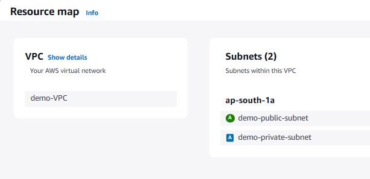

**Assignment: Create a VPC in AWS. Create a public and private subnet in it.**

Creating a demo VPC and inside the VPC adding two subnet (public and private)

**Create a VPC:**

Step 1. Search VPC in search box present in navigation bar of AWS console.

Step 2. Select create VPC.

Step 3. Write name of VPC (demo-VPC)

Step 4. Add a CIDR block of IPV4 address range.

Step 5. Click on create VPC.

**Create subnet:**

Step 1. Click on subnet from left sidebar in VPC service.

Step 2. Click on create subnet and then select the VPC created (demo-VPC)

Step 3. Add subnet name(demo-public-subnet) and IPV4 subnet CIDR block range.

Step 4. Repeat the same for private subnet (demo-private-subnet).

Step 5. Click on create subnet.

