**Assignment 1: Create a S3 bucket with versioning enabled for the objects. Map out a bucket policy such that every object we put within the bucket needs to be encrypted by default using KMS keys.**

**Create S3 Bucket:**

Step 1. Search S3 in navigation bar of AWS console and select S3 service

Step 2. Click on create bucket and select general purpose bucket and enter unique bucket name.

Step 3. Select ACL disabled in object owenership nd block all public access in public access settings.

Step 4. Select bucket versioning enabled and choose SSE-S3 default (we will change it to KMS afterwards).

Step 5. Click on create bucket.

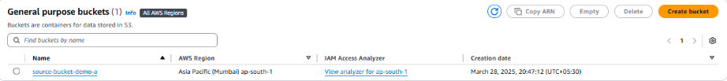

**Create customer managed KMS key:**

Step 1. Select KMS service of AWS and select customer managed KMS key from left side bar and click on create key.

Step 2. Choose key type(symmetric) and key usage(encryption and decryption) and click on next.

Step 3. Choose key name and add description and click on next.

Step 4. Choose key administrator and key usage policy(in our case click on next and don't choose any).

Step 5. A key policy will be generated by default and just click on next and create key.

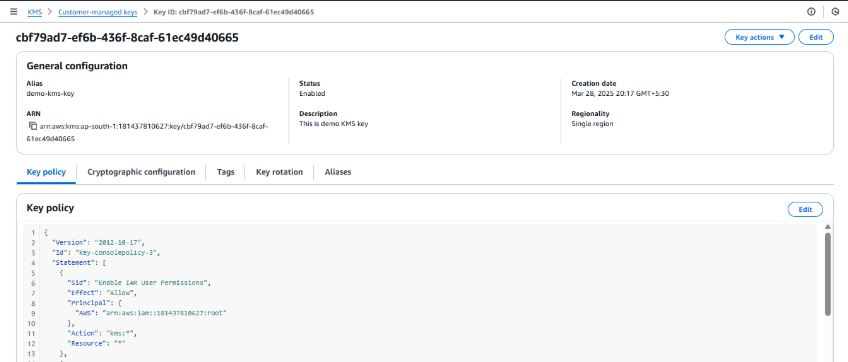

**Attach KMS key to S3 bucket:**

Step 1. Go to S3 bucket service and select the bucket created.

Step 2. Navigate to properties of the bucket and edit default encryption.

Step 3. Change the encryption type to SSE-KMS and choose the KMS key created.

**Assignment 2: Create another s3 bucket in another account with similar configuration and implement cross account replication between both buckets.**

1. Create s3 bucket in another account and create KMS in that account and attach KMS key to the destination account s3 bucket using the above assignment steps only.

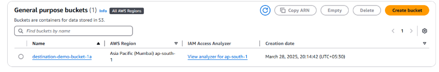

2. Create IAM role in source account:

Step 1. Search IAM from search bar and select IAM and select role from left side bar and click on create role.

Step 2. Select AWS service and choose S3 and create role.

Step 3. Add inline policy to the role created :

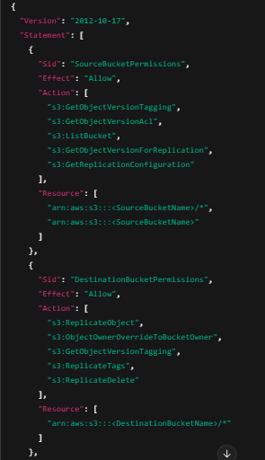

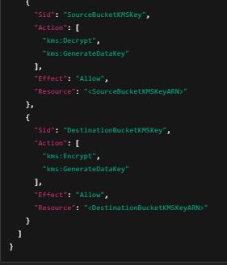

- Source bucket permissions for replication configuration access.

- Destination bucket permissions to replicate and store objects.

- KMS Encrypt/Decrypt permissions for both the source and destination bucket KMS keys.

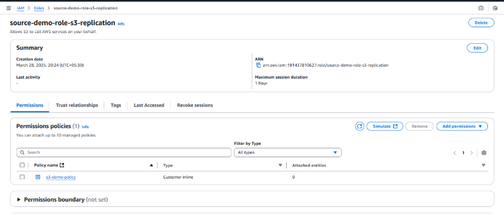

3. Edit KMS key policy in both the accounts

In Source account add this policy to key policy:

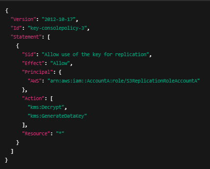

In destination account add this policy to key policy:

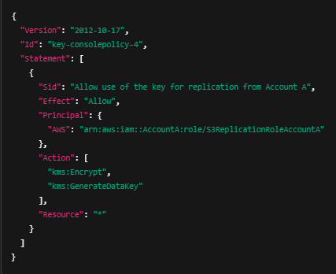

4. Edit the bucket policy in destination account:

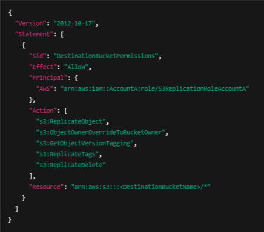

5. Set up S3 replication rule in source account

Step 1. Select S3 bucket created in source account and click on management and select replication rule. 

Step 2. Create replication rule and entering rule id, source and destination bucket id name and account number of desination bucket id.

Step 3. Choose IAM role created and select Replicate objects encrypted with AWS Key Management Service (AWS KMS) from encryption. 

Step 4. Enter KMS key arn of destination KMS key.

Step 5. Click on save changes.

Now We can check replication works or not by just adding a file to source account s3 bucket and it will be replicated to destination account s3 bucket.

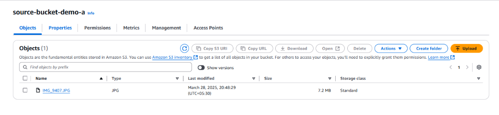

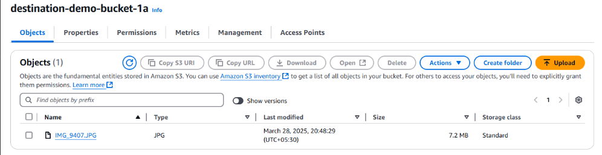

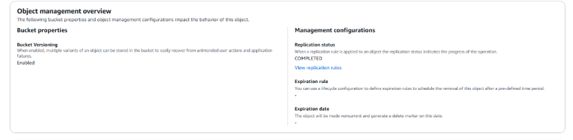