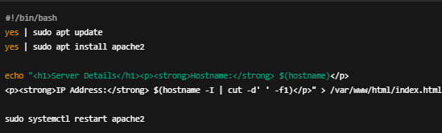

**Assignment: Launch an ALB in AP-South-1 region and load balance the traffic to 2 EC2 instances.**

**Create 2 EC2 instance:**

Step 1. Select EC2 service from search bar of AWs console and click on launch instance.

Step 2. Enter the configurations like name, key pair, add http port to security group in inbound rules, at last add script to user data in addition information section:

This script will update and install apache2 and run the index.html file when accessed through public ipv4 address.

Step 3. Select number of instances as 2 and click on launch instances. 

Step 4. Name the instances after they are launched from EC2 dashboard.

**Create Target group:**

Step 1. Select target group from left side bar of EC2 service page and click on create target group.

Step 2. Choose target type (instances), name, ip address type(IPV4), VPC(default VPC), health check protocol(HTTP) and health check path (/) and click on next.

Step 3. Select the two instances created and choose the ports for selected instances (80) and click on include as pending below and click on create target group.

**Create Application Load balancer:**

Step 1. Select elastic load balancer from left side bar and click on create load balancer and select application load balancer.

Step 2. Add load balancer name, select VPC, choose atleast two AZ and add security group allowing http traffic to inbound rule from anwhere to access the load balancer.

Step 3. Add target group created and click on create load balancer.

Now wait for some time till the load balancer state changes from provisioning to active and then copy DNS from load balancer and paste it to browser and run it.