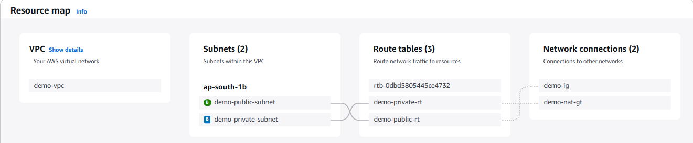
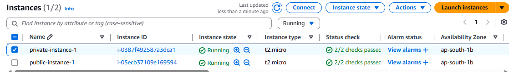
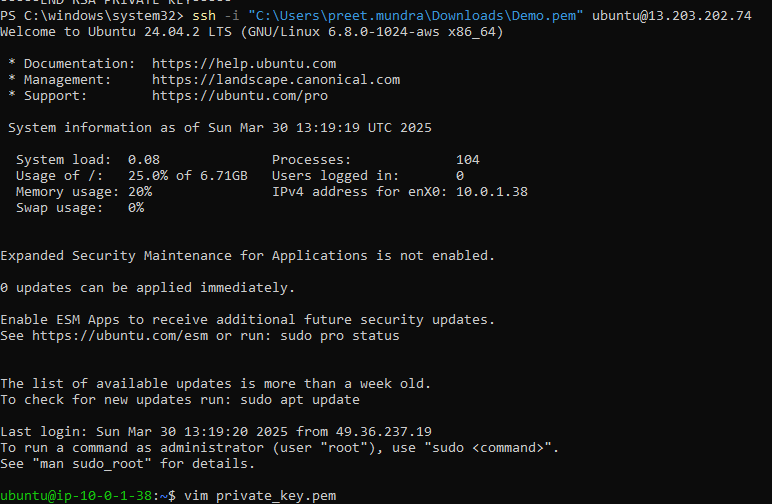
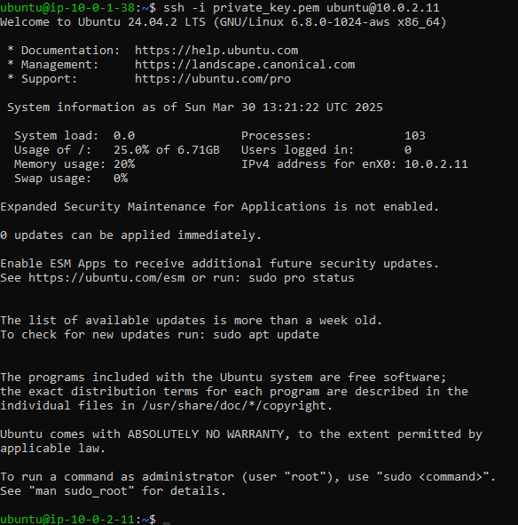
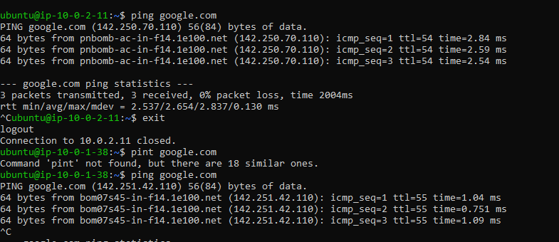
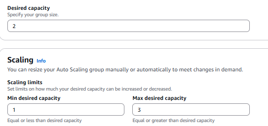
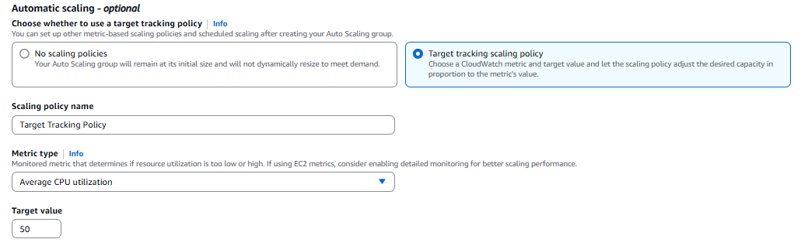
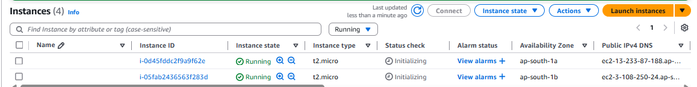
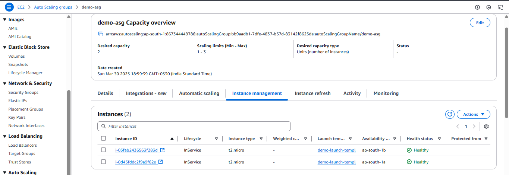

**Assignment :**
**1. Launch a VPC with 2 Subnets (1 Public, 1 Private)**
**2. Create an EC2 instance in both public and private subnets. The private subnet instance should only be accessible from the public subnet over SSH. Both instances should be able to communicate to the internet.**
**3. Create Auto Scaling group of EC2 instances and scale in/out based on Average CPU Utilization**

**1. Launch a VPC with 2 Subnets (1 Public, 1 Private)**

Step 1. Search VPC from search bar of AWS console and click on create VPC.

Step 2. Add name to VPC and add CIDR IPV4 range and click on create subnet.

Step 3. Select on subnet from left side bar and click on create subnet

Step 4. Add 2 subnet - private subnet, availability zone and public subnet with subnet CIDR IPV4 block size/

Step 5. Click on create subnet.

Step 6. Select internet gateway and create internet gateway and attach it to VPC.

Step 7. Create 2 route tables one for public subnet and one for private subnet.

Step 8. In public route table add public subnet in subnet association and in routes add internet gateway from anywhere so that public subnet can be accessed from internet through internet gateway.

Step 9. In private route table add private subnet in subnet association.

Step 10. Select NAT gateway, click on create NAT gateway and choose public subnet created and attach elastic ip to NAT gateway.

Step 11. Update the private route table for internet access through NAT gateway.

**2. Creating EC2 instance in both public and private subnet.The private subnet instance should only be accessible from the public subnet over SSH. Both instances should be able to communicate to the internet.**

Step 1. Create EC2 instance for public subnet and edit network settings with created VPC, public subnet in that VPC, Enable auto assign public ip and click on launch EC2 instance.

Step 2. Create EC2 instance for private subnet and edit network settings with created VPC, private subnet in that VPC, Disable auto assign public ip, in security group allow from CIDR IPV4 block of public subnet range and click on launch EC2 instance.

Step 3. Copy private key of private EC2 instance and connect to public EC2 instance using SSH. 

Step 4. Create a file and paste the private key. change mod of file to 400 so that it is read only.

Step 5. Connect to private subnet EC2 instance from public subnet EC2 instance through SSH.

To check both can access internet use command:
# ping www.google.com

**3. Create Auto Scaling group of EC2 instances and scale in/out based on Average CPU Utilization**

Step 1. Select auto scaling group from EC2 service sidebar.

Step 2. Click on create ASG and add name, choose launch template or create launch template.

Step 3. Choose default VPC and availability zone.

Step 4. Enter the desired, minimum and maximum capacity.

Step 5. In automatic scaling choose target tracking group and select average CPU utilization.

Step 6. Click on create auto scaling group.

Now we can see that 2 ec2 instance according to the template have been created.

