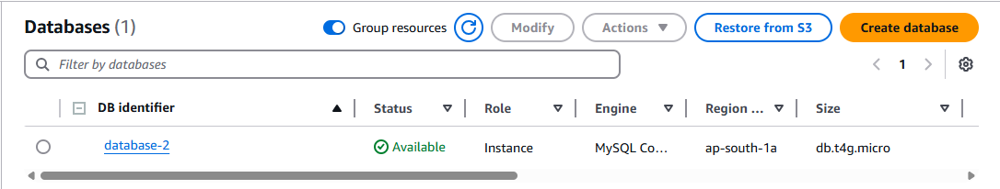
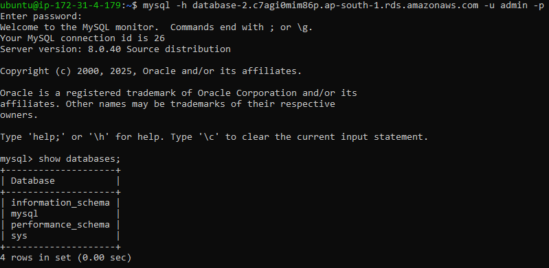
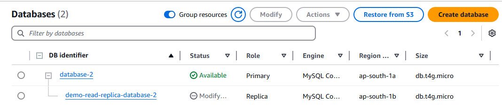
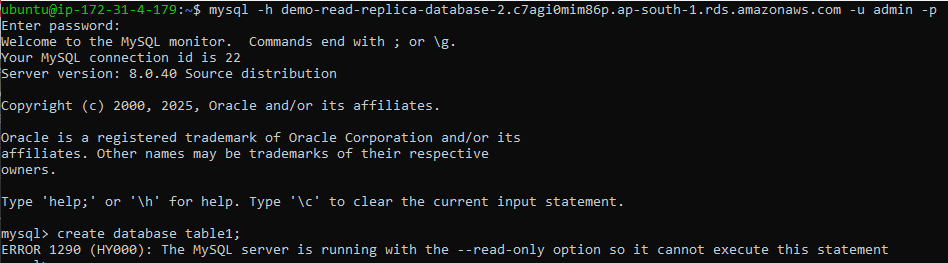
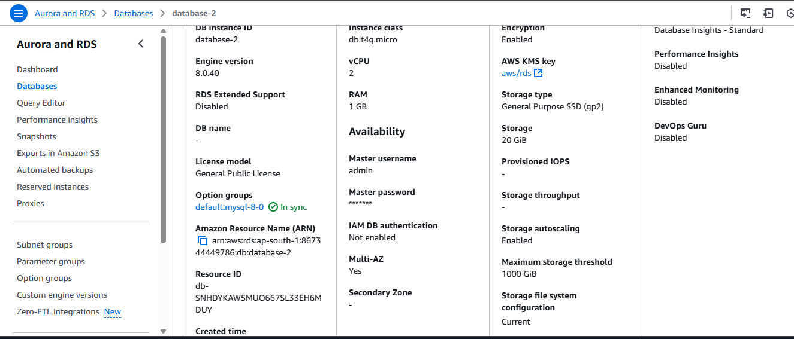

**Assignment: Create RDS and understand the options related to muti AZ, read replica**

Creating private RDS of database engine Mysql and accessing it using EC2 instance in same VPC.

**1. Creating DB instance:**

Step 1. Search for RDS service and click on create Database.
Step 2. Choose database creation method "Standard Create" and select database engine "Mysql".
Step 3. Select the engine version according to requirement and choose template "Free tier".
Step 4. Add name to the Database, and user and also provide password for credential management.
Step 5. Select "no" in public access so that no one can easily access the Database and click on create database.

**2. Creating EC2 instance and connecting to database:**

Step 1. Create EC2 instance and choose the same VPC in which the Database is created and click on launch instance.
Step 2. SSh into EC2 instance and run following commands:

To update the package lists for software repositories.
# sudo apt-get update

To install mysql client on instance:
# sudo apt-get install mysql-client

Step 3. Copy endpoint of RDS database.
Step 4. Using this commands you can now connect to a remote MySQL database:
# mysql -h <endpoint> -u <user_name> -p<password>

**3. Creating read replica of Database:**

Step 1. Select the Database and click on actions and choose create read replica.
Step 2. Select Database wose replica you want to create and add name to the replica.
Step 3. You can choose any region for replica eother the same region or the other and let all the configuration be set default and click on create replica.

You can connect to read replica database but cannot perform any write operations to it.

**4. Converting DB instance to Multi AZ:**

Step 1. Select the database and click on actions.
Step 2. Select Convert to multi AZ deployement and click on create.

Now you can check that our Database instance has multi AZ available.

Now if our primary database goes down then it will connect to same database present in different AZ.

**Assignment: Understand private and public db connection**

Public DB have a public endpoint which allows everyone over the internet to access it directly. Anyone with the correct credentials and network permissions can connect from anywhere.

Private DB have also an endpoint but only accessible by devices present in same VPC. As we saw in above assignment that EC2 instance was made in same VPC in which the database instance was created so that it can easily connect to database.