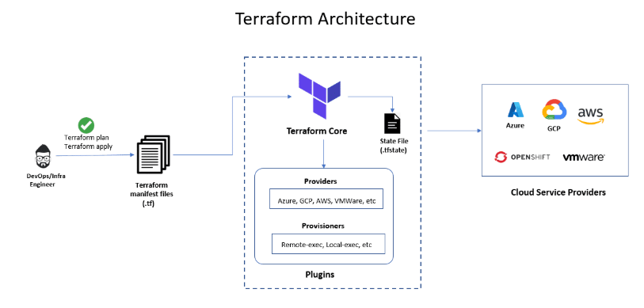
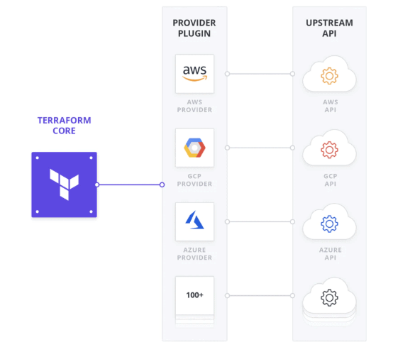
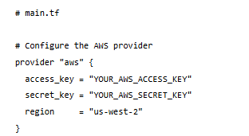
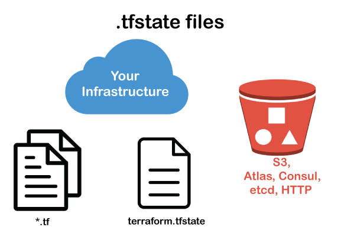

**Assignment: Create documentation about the basics of Terraform. Include your learnings about Terraform providers, TF state, lock file, and basic commands.**

**Basics of terraform**

Terraform is a tool for building, changing, and versioning infrastructure safely and efficiently. Terraform can manage existing and popular service providers as well as custom in-house solutions.

The key features of Terraform are:

Infrastructure as Code: Infrastructure is described using a high-level configuration syntax. This allows a blueprint of your datacenter to be versioned and treated as you would any other code. Additionally, infrastructure can be shared and re-used.

Execution Plans: Terraform has a "planning" step where it generates an execution plan. The execution plan shows what Terraform will do when you call apply. This lets you avoid any surprises when Terraform manipulates infrastructure.

Resource Graph: Terraform builds a graph of all your resources, and parallelizes the creation and modification of any non-dependent resources. Because of this, Terraform builds infrastructure as efficiently as possible, and operators get insight into dependencies in their infrastructure.

Change Automation: Complex changesets can be applied to your infrastructure with minimal human interaction. With the previously mentioned execution plan and resource graph, you know exactly what Terraform will change and in what order, avoiding many possible human errors.

Following are the general steps that are involved in the lifecycle of a resource creation:

1. Define: Author your Infrastructure as Code in a Terraform configuration file with all the required blocks.

2. Initialize: Initialize the Terraform working directory and download any necessary plugins. This is usually done using <terraform init> command.

3. Review: Review the Terraform execution plan to see what changes will be made to the infrastructure. This is done using the <terraform plan> command. Running this command will show the actions that Terraform is going to perform when <terraform apply> command is run.

4. Apply: Apply the changes to create or modify the infrastructure. Once you are comfortable with the changes that are shown in the output of <terraform plan> command, you can apply those changes using <terraform apply> command.

5. Inspect: You can Inspect the state of the infrastructure using the Terraform state file.

**Terraform providers**

Terraform providers are modules that enable Terraform to communicate with a diverse range of services and resources, including but not limited to cloud providers, databases, and DNS services. 

Providers are available for numerous services and resources, including those developed by major cloud providers like AWS, Azure, and Google Cloud, as well as community-supported providers for various services. By utilizing providers, Terraform users can maintain their infrastructure in a consistent and reproducible manner, regardless of the underlying service or provider. 

Here’s an example of how to configure the AWS provider in Terraform using code:

**TF state**
Terraform tfstate is a JSON file that contains information about the current state of infrastructure that Terraform manages. It also contains the details of the resources that has created, modified, or destroyed by terraform in a particular environment. Tfstate files also include metadata, and that metadata describes the resources' dependencies and relationships, which Terraform uses to manage infrastructure changes effectively.

Managing tf state:

1. Use a remote backend(like S3)
2. Local state file
3. Lock tfstate files(using dynamoDB)
4. Use state backups(regularly take backups of state file)

**Lock file**

**.terraform.lock.hcl file**

The file named .terraform.lock.hcl is known as the lock file or the dependency lock file. It concerns itself with the dependencies of your Terraform configuration. When you initialize a Terraform project using the terraform init command, Terraform generates or updates the lock file that pins down the exact versions of the providers being used, which helps prevent issues that could arise from updates to those providers when configurations are applied by you or your team members.

The lock file is created by Terraform when you issue the terraform init command.

**Terraform basic commands:**

1. Initialize and download plugins

# terraform init

2. Plan and see what are the resources need to be added comparing with state file

# terraform plan

3. Apply the changes which are not present in state file

# terraform apply

4. Check for syntax error

# terraform validate

5. Check for output

# terraform output

6. Check for state file

# terraform show

7. Check for providers or plugins downloaded

# terraform provider

8. Visual representation of state

# terraform graph

9. Import an existing service from cloud

# terraform import <resource_type>.<resource_name> <id>

10. To see the difference between configuration file and previous state

# terraform refresh

11. Create new workspace and switch

# terraform workspace new <workspace_name>

12. Switch to existing workspace

# terraform workspace select <existing_workspace_name>

13. List all workspace

# terraform workspace list

14. Show current workspace

# terraform workspace show

15. Delete specified workspace

# terraform workspace delete <specified_workspace_name>

16. Destroy the infrastructure created

# terraform destroy

17. Get the current state and outputs it to a local file

# terraform state pull > state.tfstate