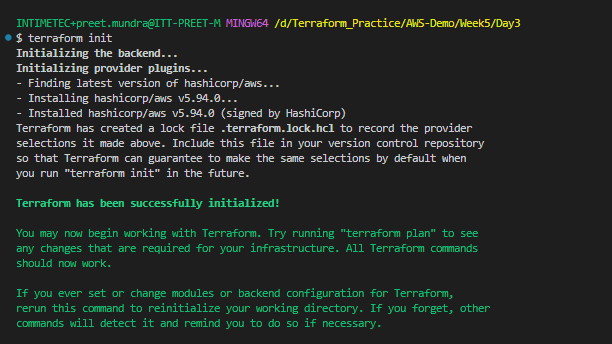
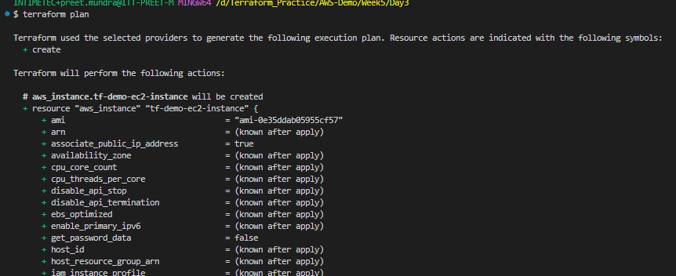
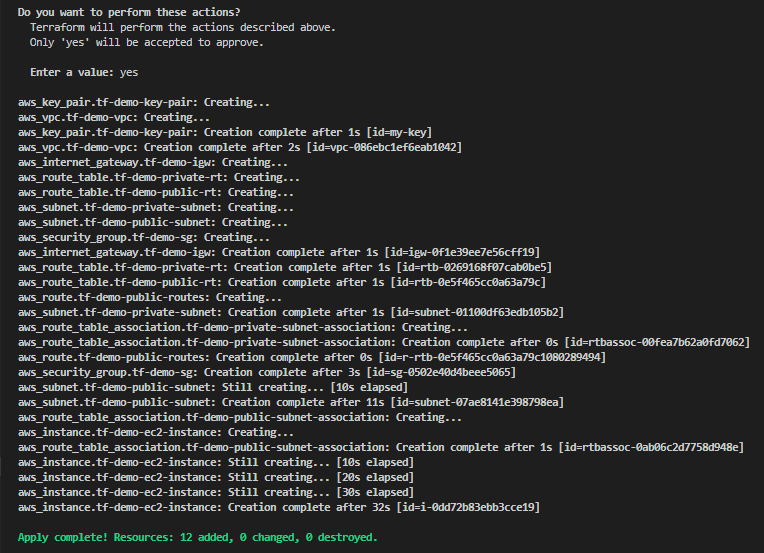
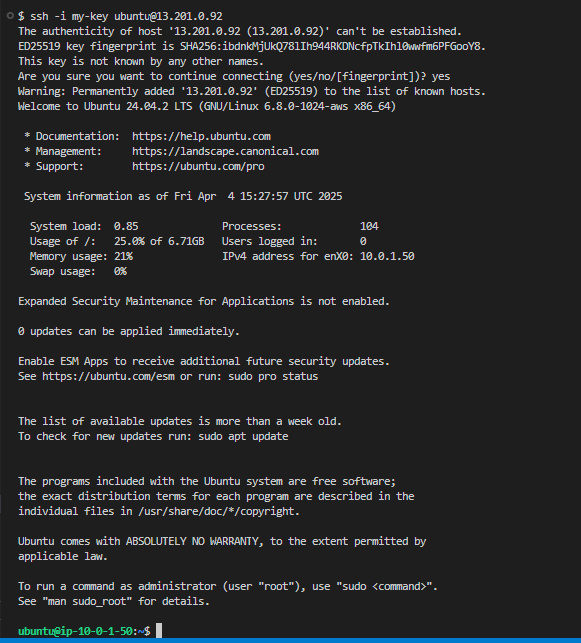

**Assignment: Create EC2 instance (Windows/Linux) using Terraform inside the previously created VPC & Subnet**

Created an EC2 instance in public subnet created in VPC.

Run the commands:

# terraform init

# terraform plan

# terraform apply

Now connect to EC2 instance using ssh

# ssh -i <path to private key> ubuntu@<public ip address>

