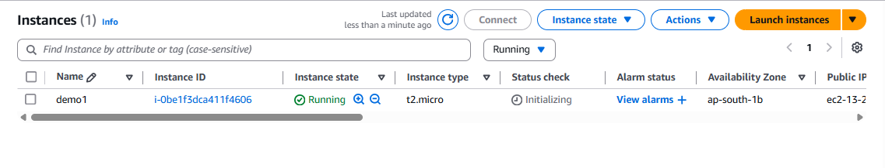
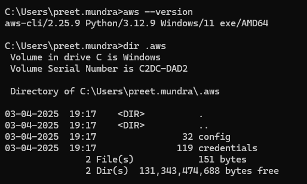
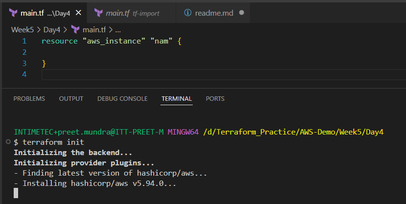
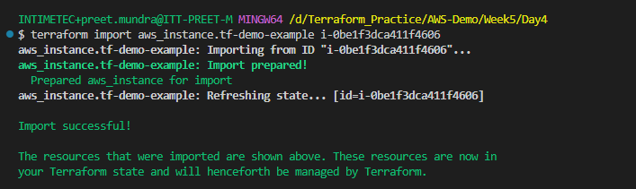
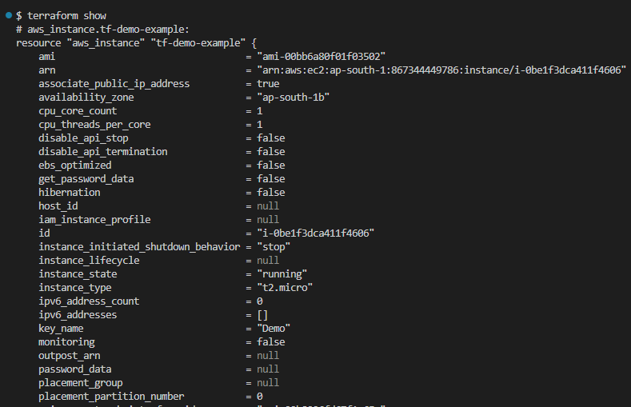
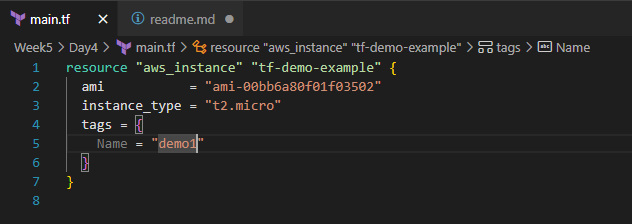
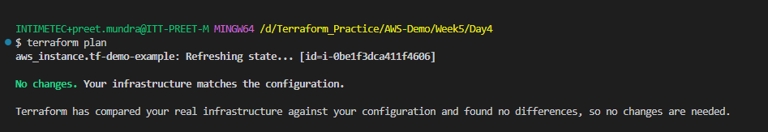

**Assignment: Import an existing resource from AWS in Terraform state file**

Already existing EC2 instance on AWS cloud:

AWS credentials are configured using AWS cli:

Run command to initialize the plugins with empty resource block

# terraform init

Copy instance id from AWS cloud and run terraform import command:

# terraform import <resource_type>.<resource_name> <id>

# terraform import aws_instance.tf-demo-example i-0be1f3dca411f4606

We can check the current state using this command, it consist of my EC2 instance state:

# terraform show

Now add arguments of your instance according to provided in AWS cloud

Now if we run plan or apply command it will give "No changes"

