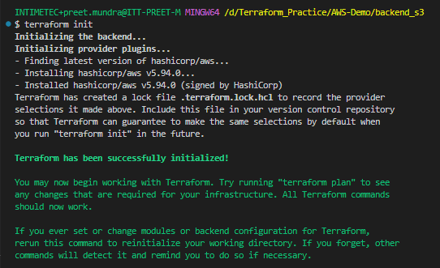
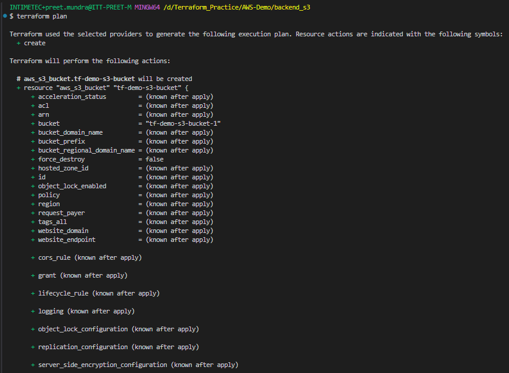
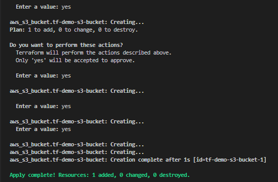
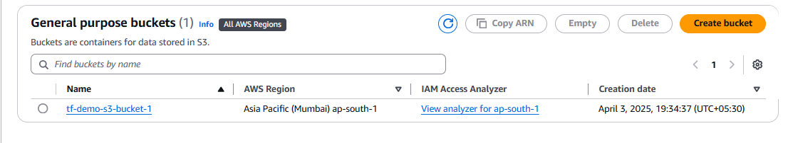
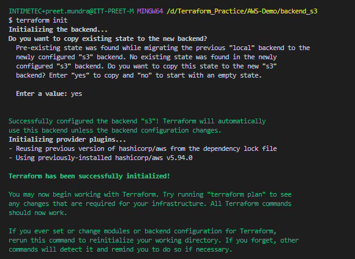
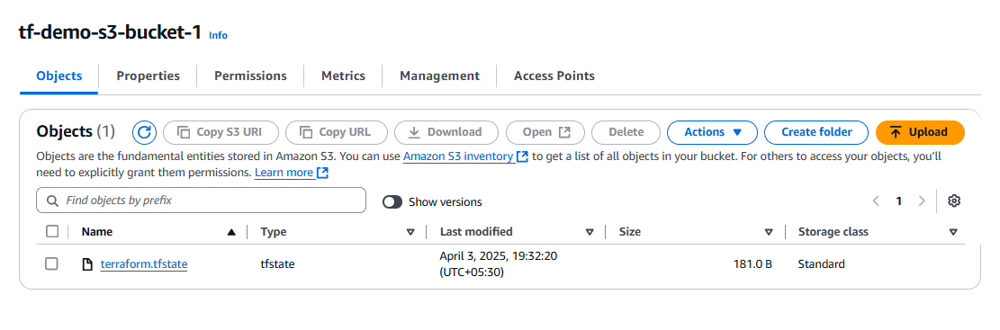

**Assignment: Configure the remote backend in S3 to store the state file for your terraform module**

Create S3 bucket only(No backend.tf file) using terraform:

Run the following commands:

# terraform init

# terraform plan

# terraform apply

Now S3 bucket is created:

Now write backend.tf file to initialze the backend

On AWS console go to S3 bucket and check:

