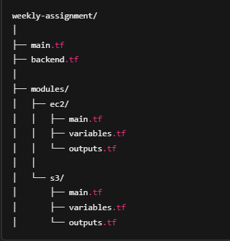
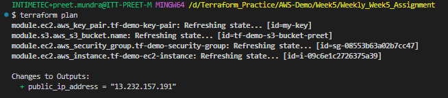
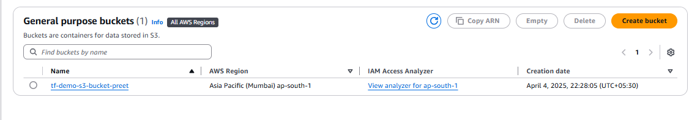
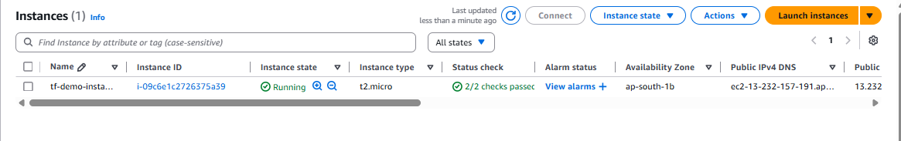
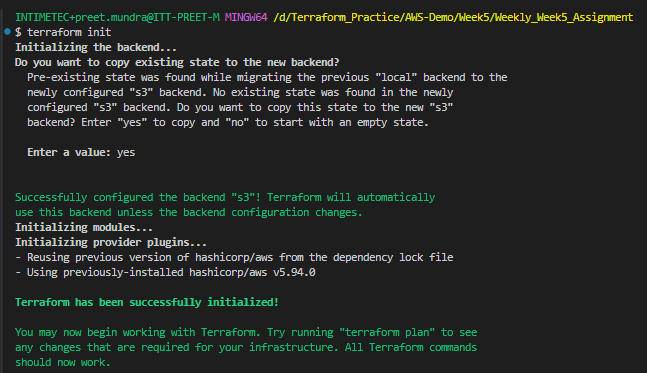
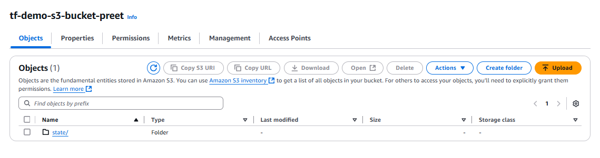

**Assignment: Deploy a static web application on EC2 instance using modularized Terraform code. The backend should be configured in S3**

Here is the modularized structure:

Before backend.tf file created 

Run the following commands:

# terraform init

# terraform plan

# terraform apply

So s3 bucket is created:

EC2 instance is created

Now create backend.tf file and run the command:

# terraform init

state file is added to s3 bucket

