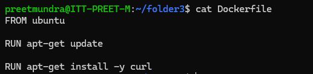
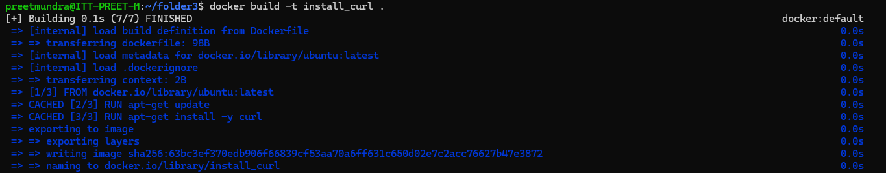
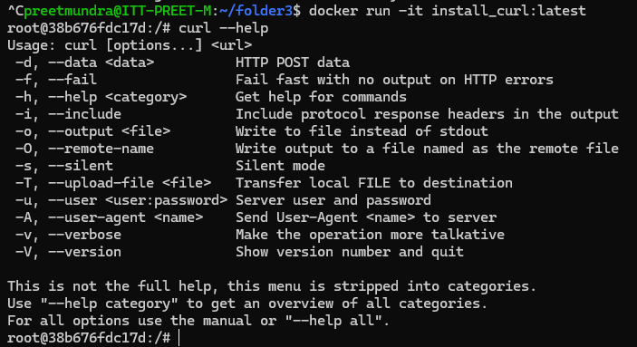

**Assignment: Write a dockerfile** 
**to update the versions of the packages currently installed on the system**
**to install CURL**

Steps:

1. Create Dockerfile

2. Build image of Dockerfile using command:

# docker build -t <image_name> <path_to_Dockerfile>

3. Run container from the image using command:

# docker run -it <image_name>

