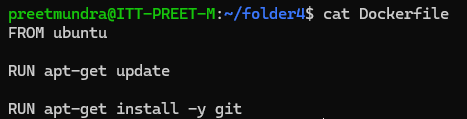
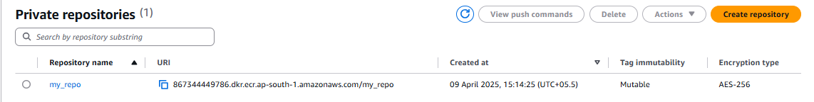
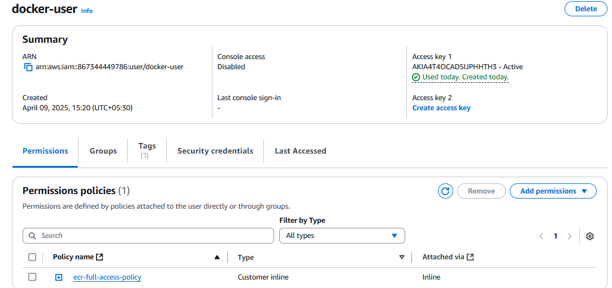
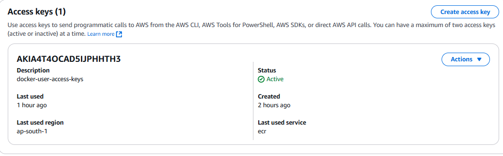
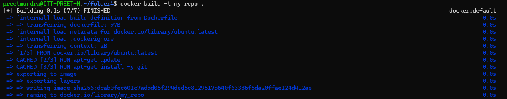
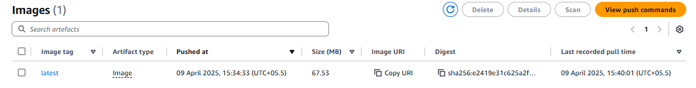

**Assignment: Create a docker image for installing GIT and push the image to the previously created Elastic Container Registry**

1. Create a Dockerfile for updating current packages and installing git.

2. Create a repo on aws using ECR(Elastic Container Registry)

3. Create IAM user with permission regarding ECR.

4. Create access keys for that user.

5. Now install aws cli and configure aws in host machine.

6. Create image of Dockerfile using command: 

# docker build -t <image_name> <path_to_dockerfile>

7. Push the image to ECR using following commands:

# aws ecr get-login-password --region <region_name> | docker login --username AWS --password-stdin <aws_account_id>.dkr.ecr.<region>.amazonaws.com

# docker tag <image_name>:latest <aws_account_number>.dkr.ecr.<region>.amazonaws.com/<image_name>:latest

# docker push <aws_account_number>.dkr.ecr.<region>.amazonaws.com/<image_name>:latest

8. Now you can see the image is pushed to ECR.

9. Pull the image from ECR to you system using command:

# docker pull <uri_of_image>

10. Create and run the container using command:

# docker run -it <image_id>

11. Run git in container and it will work.