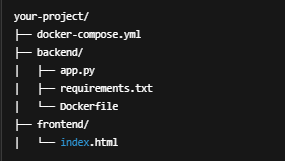
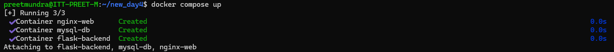
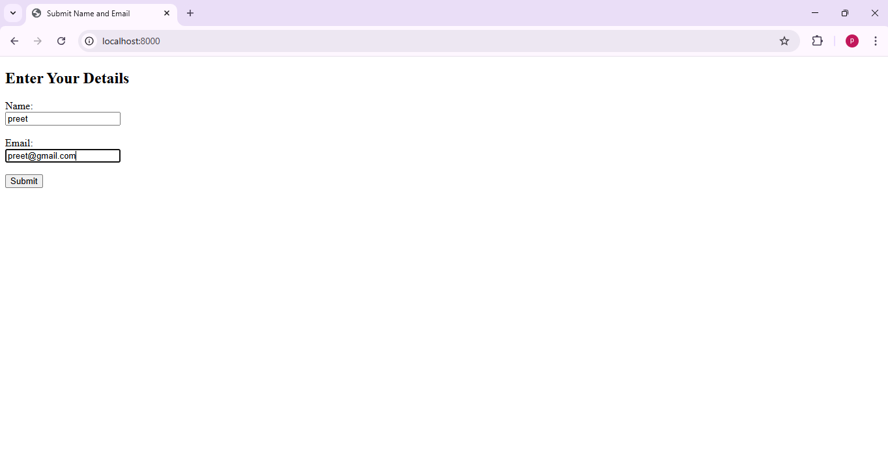
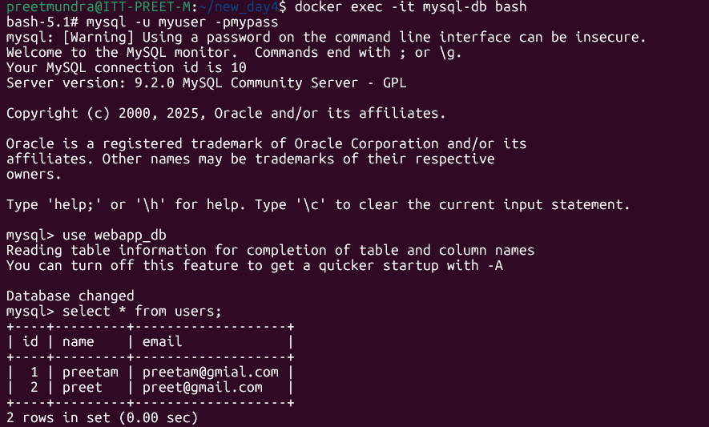

**Assignment: Create docker container for Nginx and SQL-based images using the Docker compose file. Host the web app on Nginx container and when you add data to web-app container it should be add to your SQL database.**

The below file structure for this assignment:

Run the following commands:

# docker compose up

Run localhost:8000 on browser and enter details:

Click on submit button.

Now check the data base mysql:

