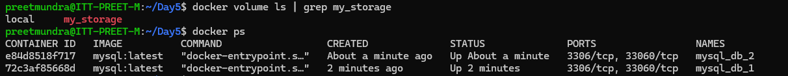
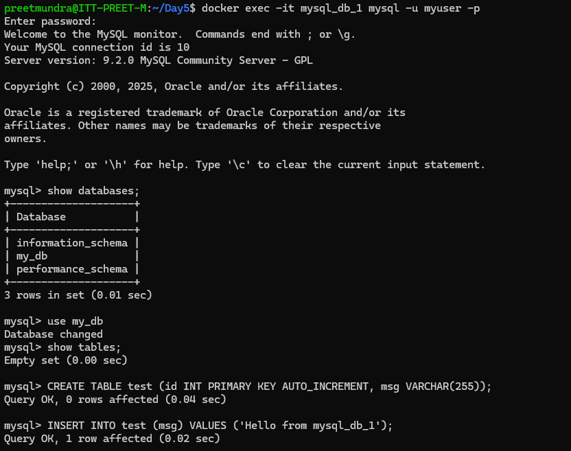
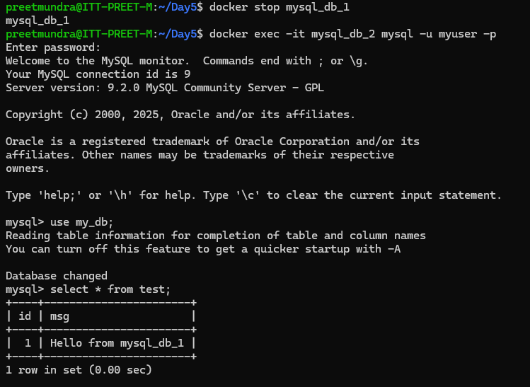

**Assignment: Create two containers and both the containers should share the common volume**

I am taking image of mysql. 

1. Creating volume using command:

# docker volume create my_storage

Creating 2 containers of mysql using command:

# docker run -d --name mysql_db_1 -e MYSQL_ROOT_PASSWORD=rootpass -e MYSQL_DATABASE=my_db -e MYSQL_USER=myuser -e MYSQL_PASSWORD=mypass -v my_storage:/var/lib/mysql mysql:latest

# docker run -d --name mysql_db_2 -e MYSQL_ROOT_PASSWORD=rootpass -e MYSQL_DATABASE=my_db -e MYSQL_USER=myuser -e MYSQL_PASSWORD=mypass -v my_storage:/var/lib/mysql mysql:latest

2. Store data in mysql container 1:

3. Opening table in mysql container 2 we can see the same data present.

