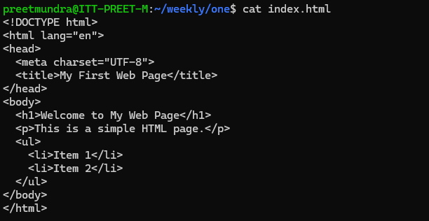
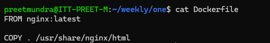
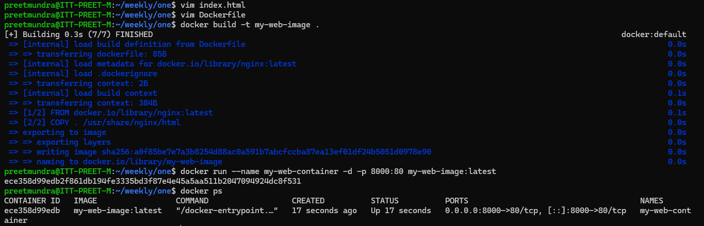
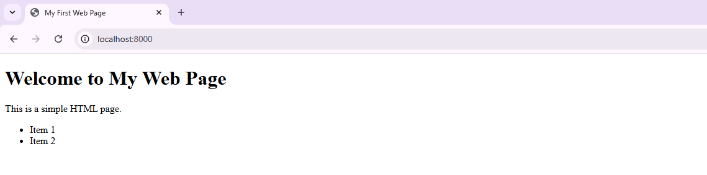

**Assignment: Create custom Dockerfile for running a sample html website**

1. Create index.html file for static web page

2. Create Dockerfile to build image for static web page:

3. Build image using command: 

# docker build -t my-web-image .

4. Build the container from the image using command:

# docker run -d --name my-web-container -p 8000:80 my-web-image:latest

Check browser on http://localhost:8000

