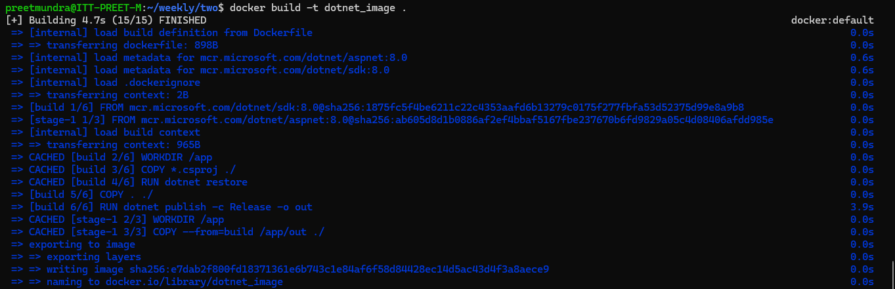
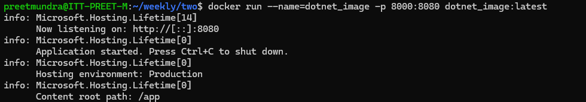
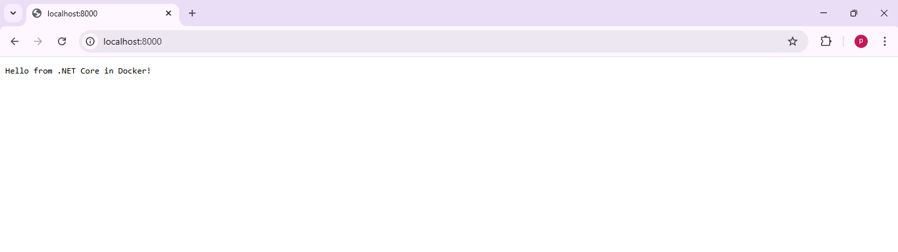

**Assignment: Create Dockerfile to build and run .NET core application**

1. Run docker command to build image from dockerfile:

# docker build -t dotnet_image .

2. Create container from the image using command:

# docker run --name=dotnet_container -p 8000:8080 dotnet_image:latest

See on web browser by searching localhost:8000

