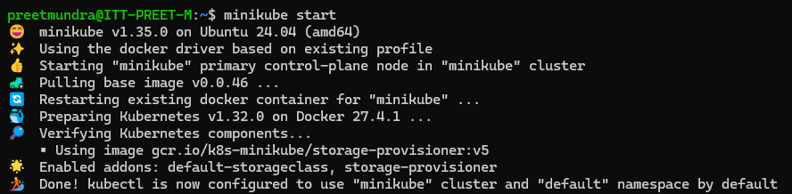
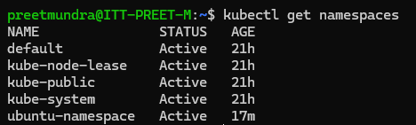
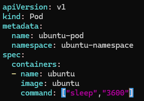
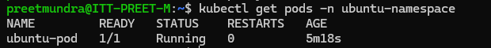
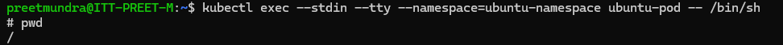

**Assignment: Create a basic minikube cluster on local system. Create a namespace and deploy an ubuntu POD in it.**

Run the following commands:

1. Initialize minikube

>> minikube start

2. Create namespace

>> kubectl create namespace ubuntu-namespace

3. Create yaml file for pod creation

4. Run the following command to create pod

>> kubectl apply -f <pod_file_name>

5. Get interactive shell access to a running pod

