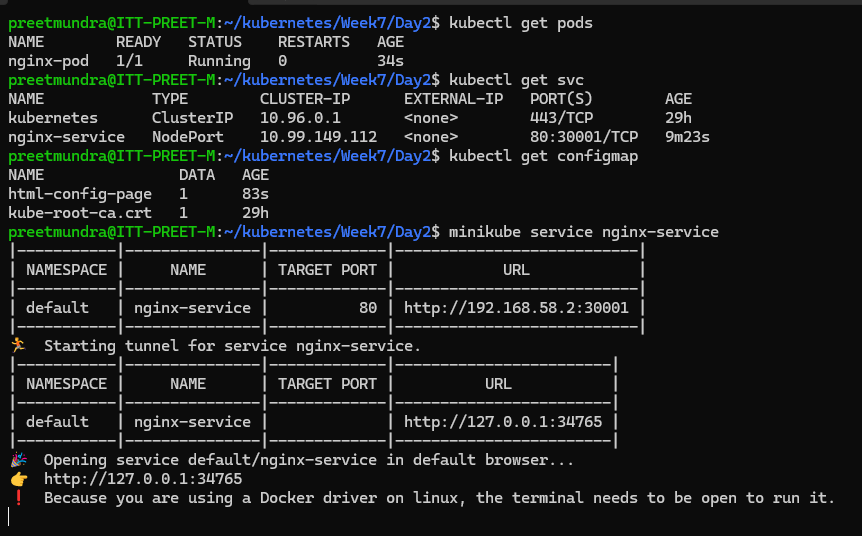
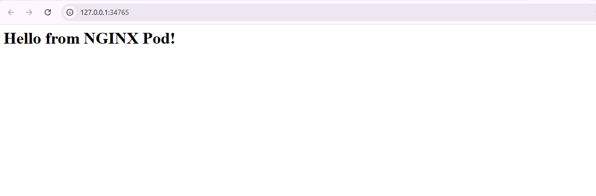

**Assignment: Create a pod with a basic HTML page and service to expose that pod.**

Create a configMap with configMap.yaml file using command:
>> kubectl create -f configMap.yaml

Create a pod with pod.yaml file using command:
>> kubectl create -f pod.yaml

Create service with service.yaml file using command:
>> kubectl create -f service.yaml

Now run command: 
>> minikube service <service_name>

Redirect to url http://127.0.0.1:34765

