**Assignment 1: Create a YAML-based Azure DevOps pipeline that builds and deploys a sample application to Azure Web App. Add the manual approval on the deployment stage.**

1. Create a Web app

Step 1: Search for web service in search bar

Step 2: Click on Create and then select Web App option to create a new Web App.

Step 3: After clicking on Create button, the new web app creation process will begin.

Step 4: After the Web App is created successfully, click on Go to resource button

Step 5: Click on Browse button to view the Web App.

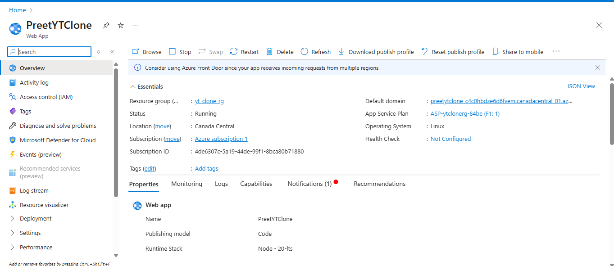

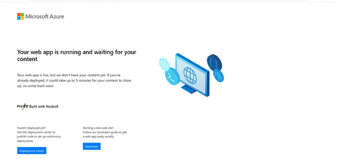

2. Create a Service Connection

Step 1: Go to azure devops. Select your organization and project.

Step 2: Click on project settings and select Service connection.

Step 3: Create a new service connection.

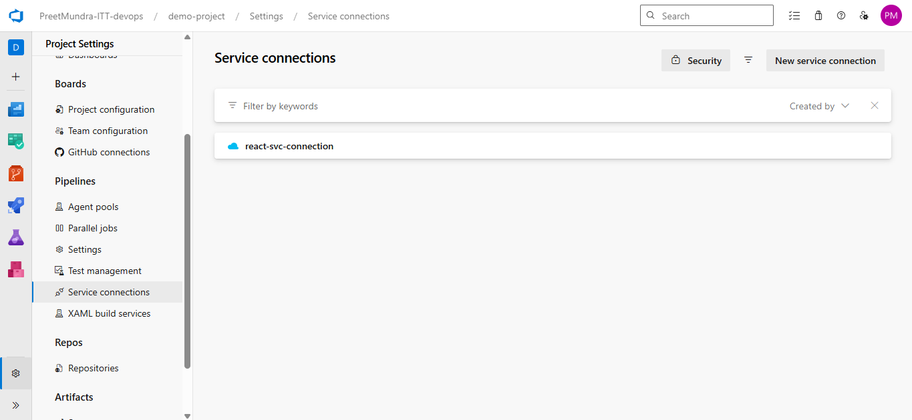

3. Create a yaml pipeline and save it to root folder in react code with name azure_pipeline.yaml

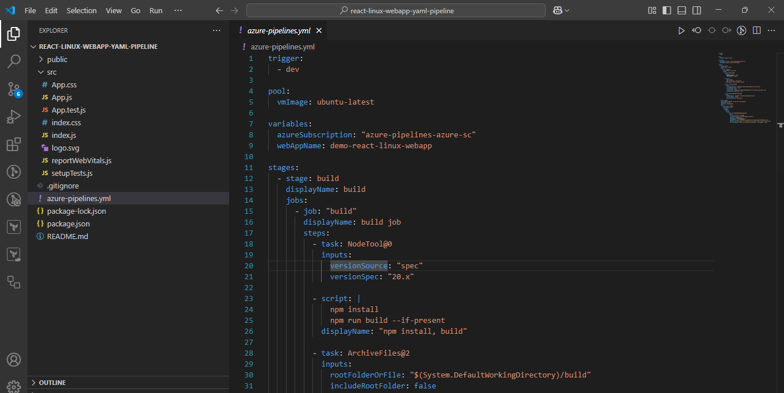

4. Publish this code to azure repos

5. Click on pipelines in azure devops side bar.

6. Search for repo and choose existing azure pipelines yaml file

7. Review your pipeline and add variable required in code.

8. Now click on run the pipeline.

9. It will ask for manual approval in Deploy stage.

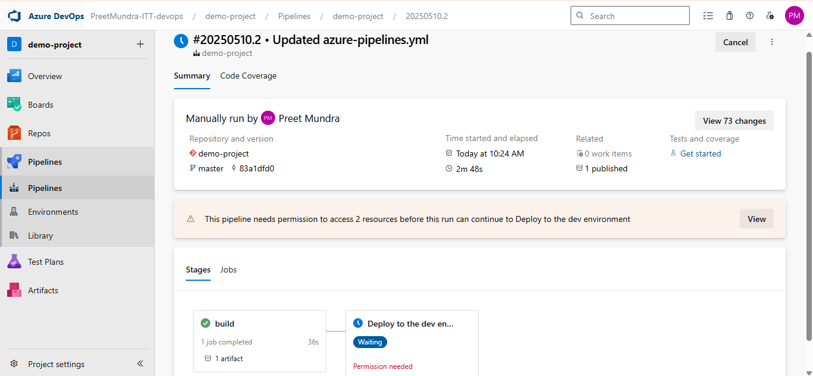

10. After manual approval pipeline is in running properly.

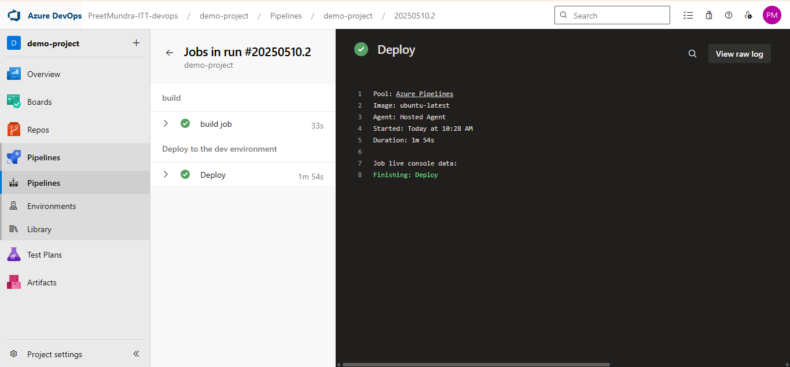

11. We cann see the output in azure app service page. 

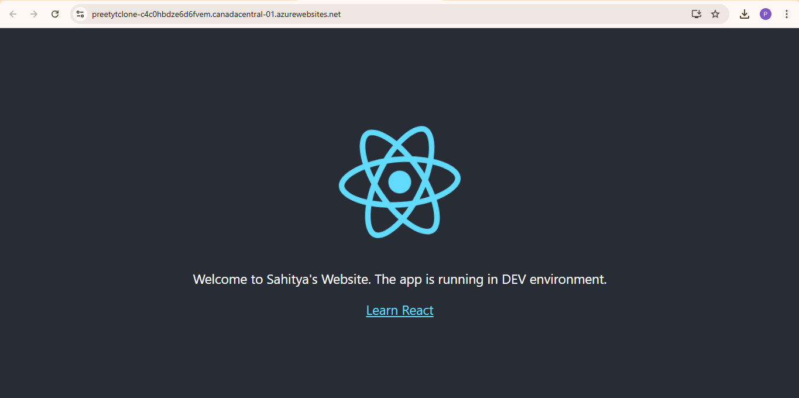

**Assignment 2: Implement Branch & Build Policies to ensure PR validation before merging.**

1. Open your project

2. Select repos from side bar and click on branch you want to select.

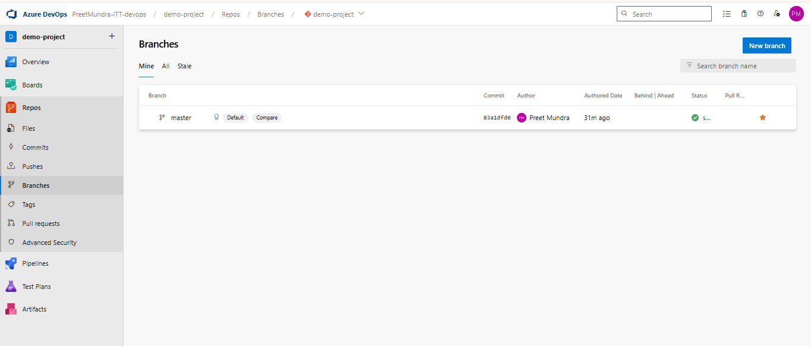

3. Click on 3 dots on side of branch and select branch policies

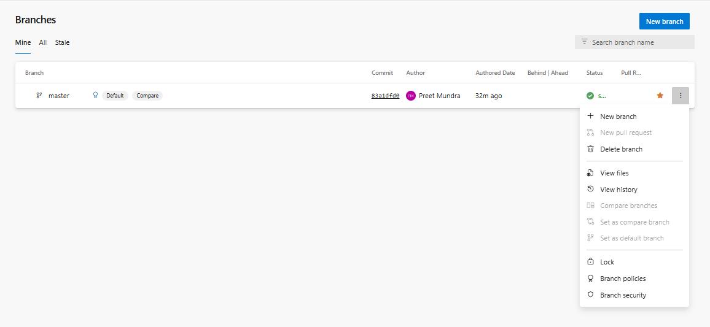

4. Update the branch and build polies like this:

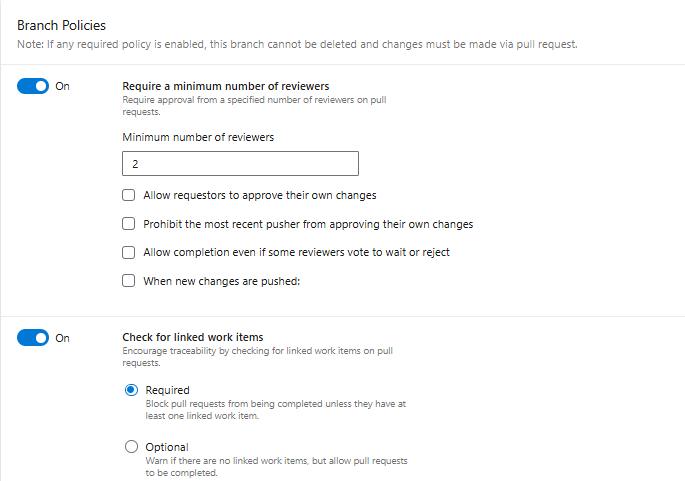

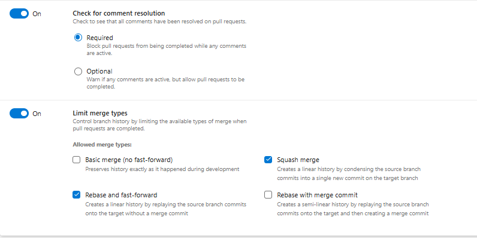

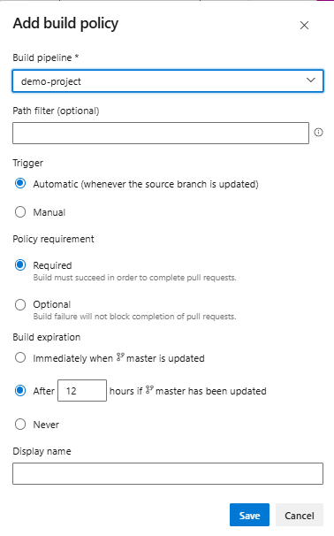

What does this do ? 

1. Pull Request (PR) Flow:

New PR is Raised (to master branch):

Your build pipeline (demo-project) will automatically trigger.

The pipeline will try to install dependencies, build, and zip your React app.

Build Validation:

Because you set the policy as Required, the PR cannot be completed unless the build succeeds.

This ensures your code compiles and passes build steps before merging to master.

Post-Merge:

Once the PR is approved (2 reviewers), linked to a work item, and the build passes:

The PR is merged into master.

Depending on how your pipeline is configured (trigger: [master] or CI trigger), the build will run again on the updated master branch to confirm stability.

Minimum reviewers = 2

Build must succeed (Required)

Work item linking is mandatory

Merge types restricted to keep commit history clean

Comment resolution is enforced

Build expiration after 12 hours ensures up-to-date validation

**Assignment 3: Configure Secrets Management using Azure Key Vault.**

In this assignment the environment variable used will be stored in secret in Azure key vault service and used by azure devops pipeline.

Step 1: Select Key vault service in azure portal and create new key vault.

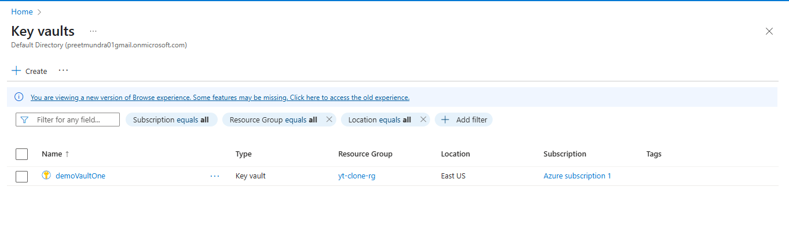

Step 2: In left side bar select Secrets in objects section and create secret.

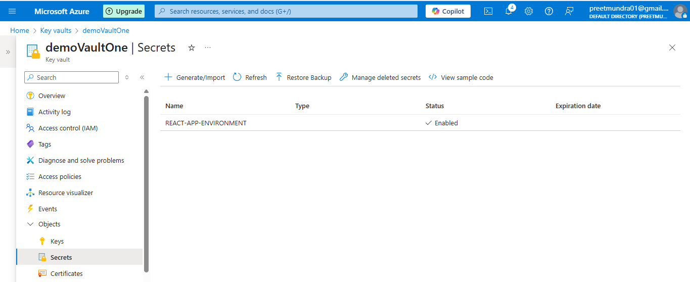

Step 3: In left side menu select iam role and add new role with key vault administrator permission with member as same as service connection created.

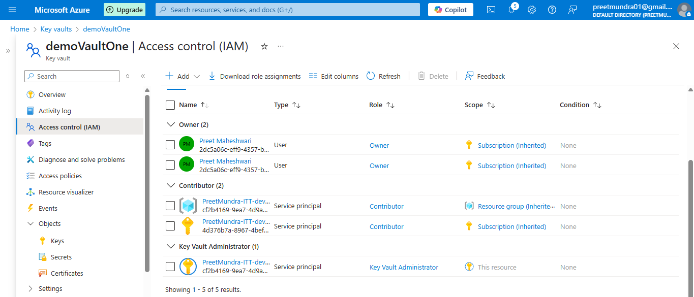

Step 4: Now update the pipeline with new one with new_azure_pipeline.yaml

Step 5: Run the pipeline.

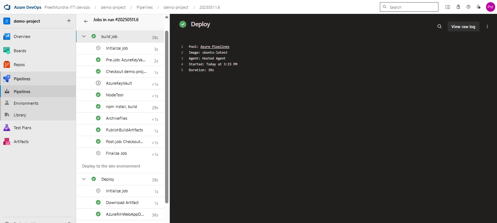