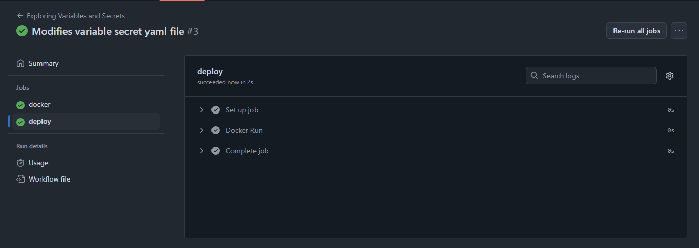
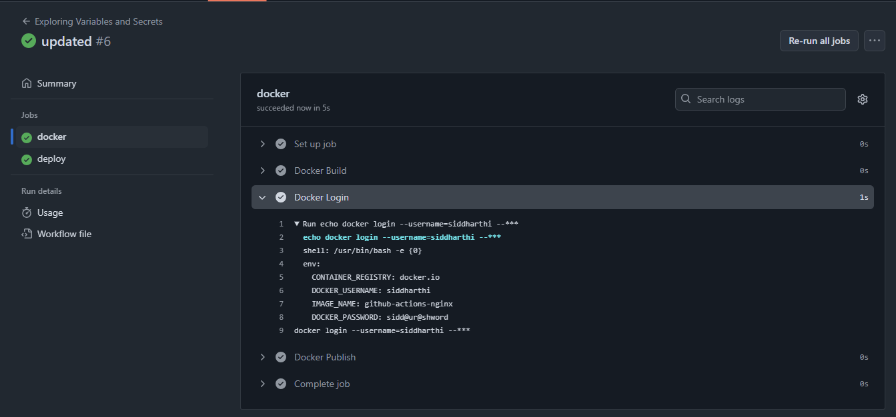
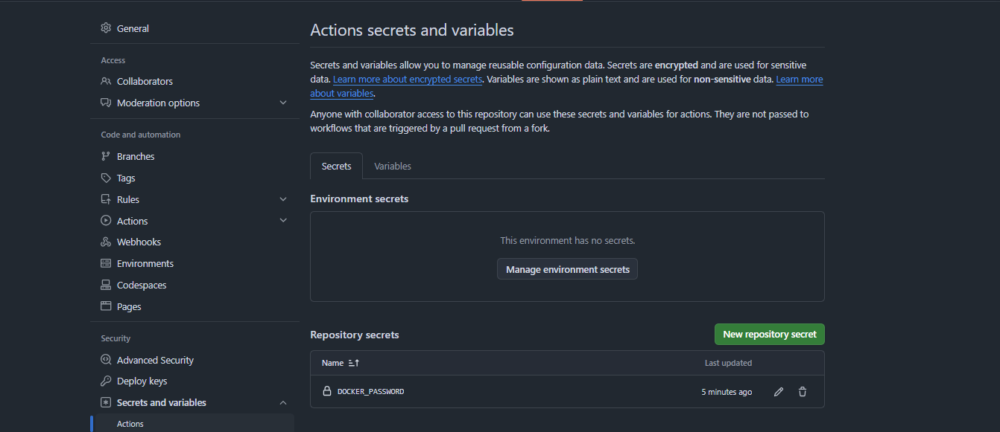
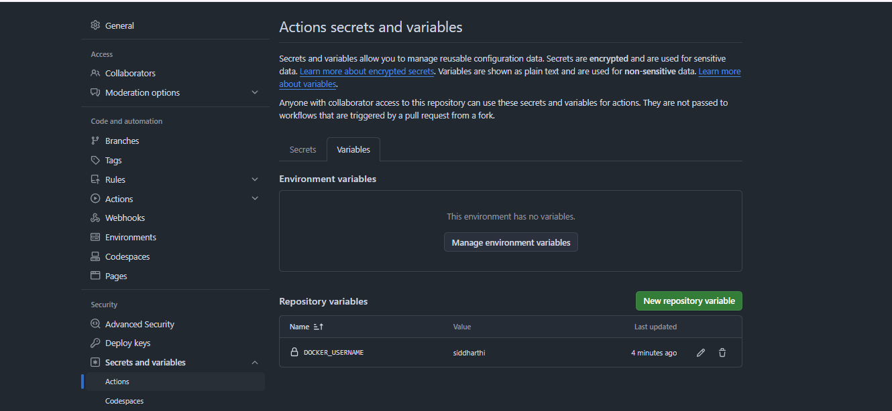
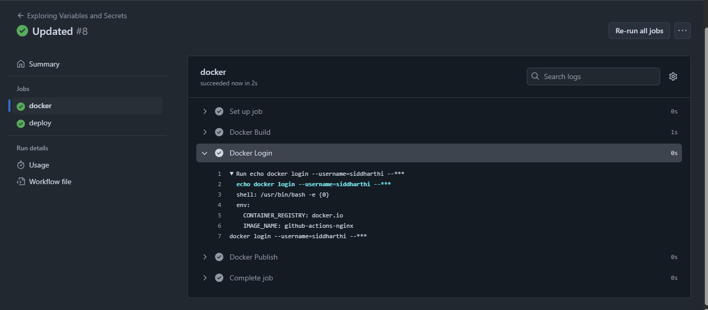

**Assignment: Use self-hosted runners and configure environment variables & secrets.**

 
1. Using ENV variables and secrets at step level

Now when we push the file env_at_steps_level.yaml to github

One of the problem with secret is that it is easily visible in logs.

2. Using env variables and secrets at job level

Now when we push the file env_at_job_level.yaml to github

Here we can see the secrets can be accessed using logs.

3. Using env variables and secrets at repo level

Now when we push the file env_secrets_at_repo_level.yaml to github

