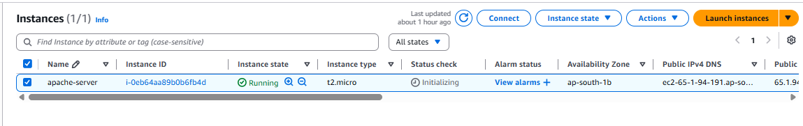
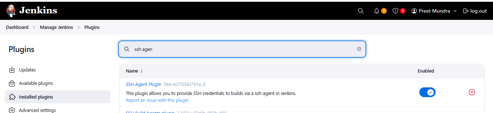
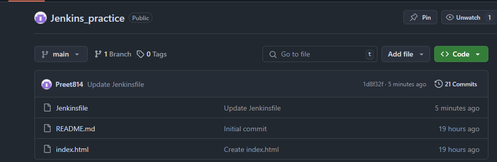
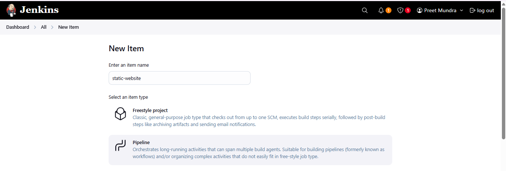
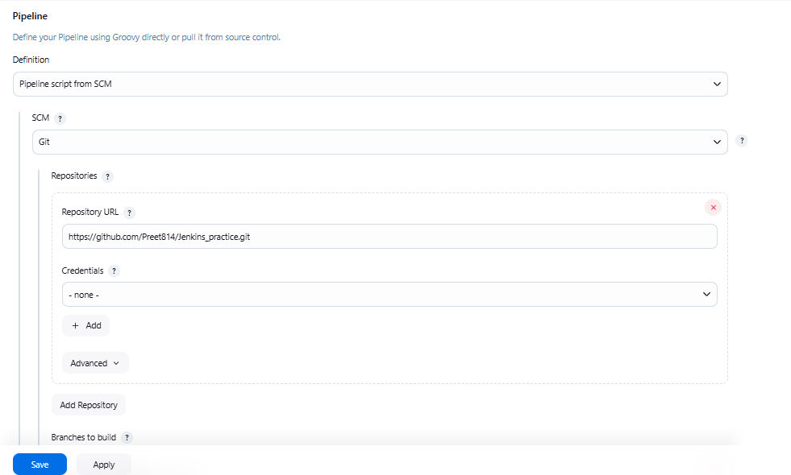
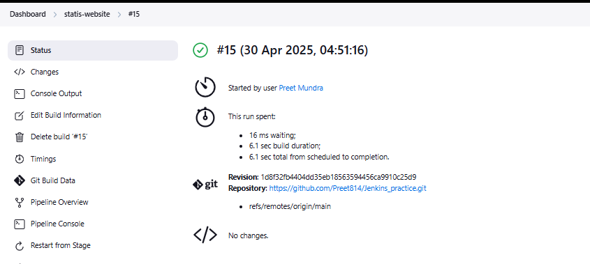

**Assignment: Create a Jenkinsfile for a pipeline Job for deploying static website over Apache server**

1. Created index.html file with static html page.

2. Created an EC2 instance for apache server and added http port 80 in security group.

3. Inside the EC2 instance installed apache2 bu running the commands:

>> sudo apt-get update
>> sudo apt-get install apache2 -y
>> sudo systemctl service apache2 enable

4. Installed ssh agent plugin in jenkins

5. Wrote jenkinsfile along with index.html and uploaded to github

6. In Jenkins UI created an item with item type pipeline

7. Configured pipeline in item :

8. Selected build now:

9. Check the server by copying public ip and pasting it to browser:

