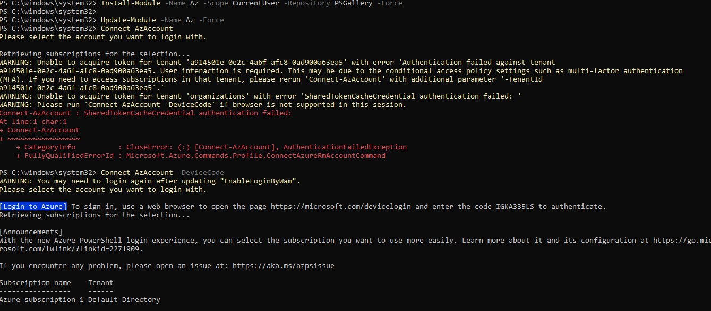
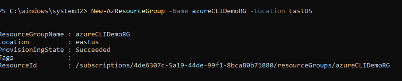
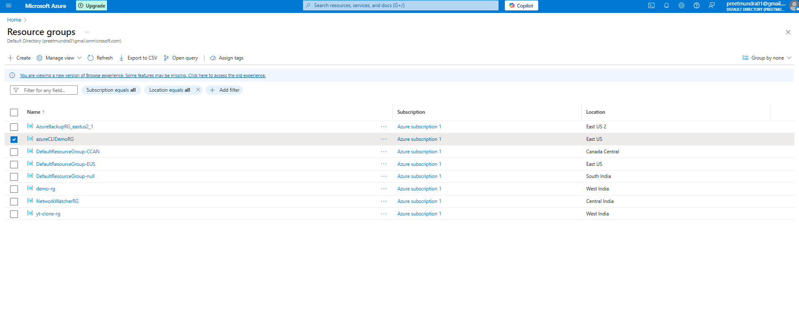
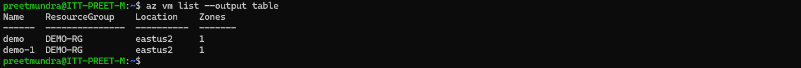

**Assignment 1: Install Azure PowerShell and create an Azure resource using a PowerShell script.**

1. Install azure powershell on windows.

Run the following commands:

>> Install-Module -Name Az -Scope CurrentUser -Repository PSGallery -Force

>> Update-Module -Name Az -Force 

>> Connect-AzAccount -DeviceCode

2. Create an azure resource using powershell

Run the following command : 

>> New-AzResourceGroup -Name azureCLIDemoRG -Location EastUS

**Assignment 2: List all VMs in your account using Azure CLI**

Step 1: Run the following command:

>> az vm list --output table

**Assignment 3: Access a Key Vault secret using Azure CLI.**

Step 1: Add secret to key vault.

Step 2: Run the following command on terminal:

>> az keyvault secret show --vault-name Preet --name secret --query value -o tsv

